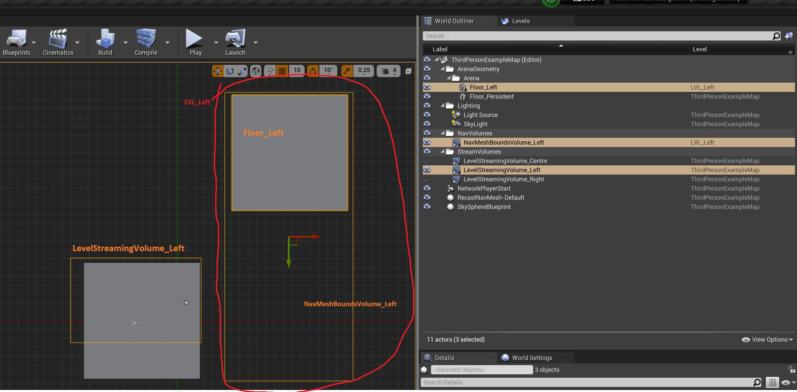
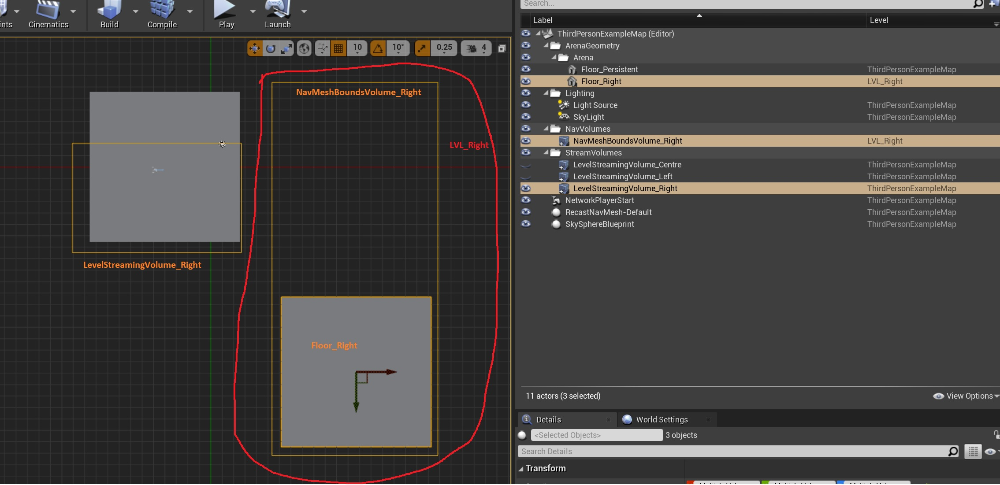
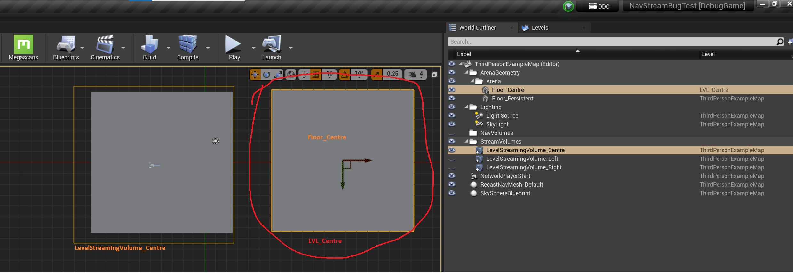
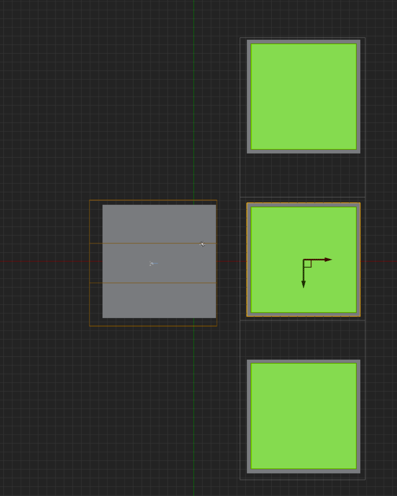
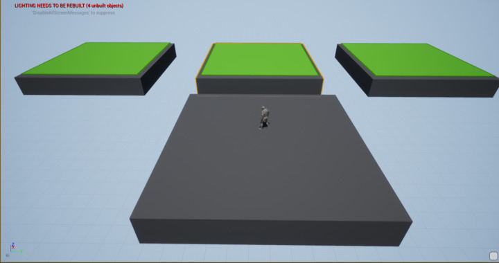
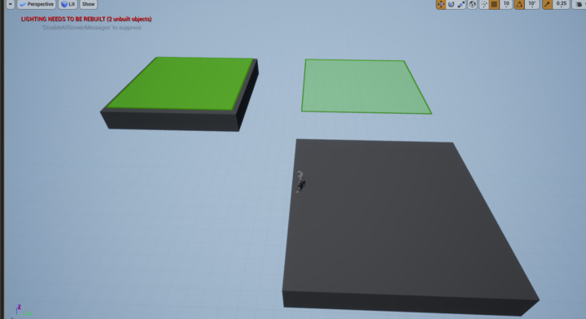
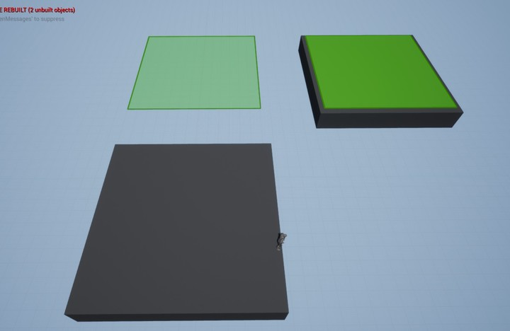
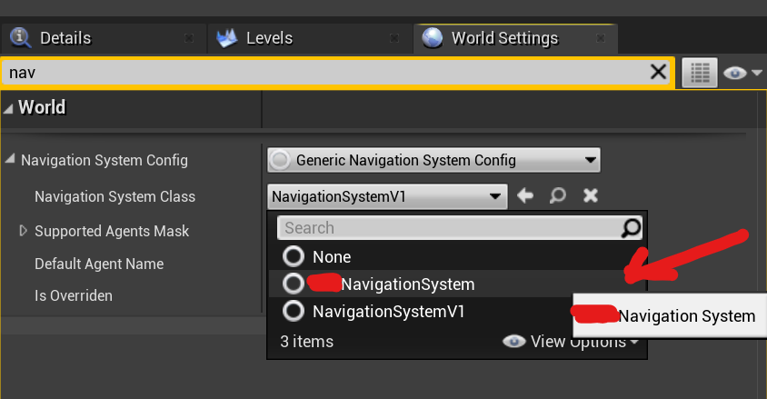

**The problem**


[UDN Post to the problem](https://udn.unrealengine.com/s/question/0D54z00007Ajn8xCAB/streaming-out-sublevels-with-overlapping-nav-volumes-will-remove-each-others-nav)


Streaming out Sub-levels with overlapping nav volumes will remove each others nav.

Our nav configuration is Dynamic with Modifiers and we don't have Nav volumes in the persistent level (except for a small mandatory one).

- we have the persistent level with 3 stream volumes that overlap.
  - **LevelStreamingVolume_Left** streams in **LVL_Left**. This brings in a floor and a nav volume
  
  - **LevelStreamingVolume_Right** streams in **LVL_Right**. This brings in a floor and a nav volume
  
  - **LevelStreamingVolume_Centre** streams in **LVL_Centre**. This brings in a floor and a nav volume
  
   
- Because how big the nav volumes are, the nav is generated like this


- When the game starts, the player is overlapping the three stream volumes, so all the levels with their Nav Volumes stream in. It looks like this



- If I start overlapping just the right or the left volumes, we can see the corresponding levels and the nav they generate. Images are from streaming only the left level and only the right level




- But, when moving from left to right (or vice versa), we can see how this happens:
  - Move all the way to the left. Only LVL_Left is there (left floor and nav)
  - Move towards the right. At some point the player overlaps the three volumes. So all levels and all the nav can be seen.
  - Keep moving to the right. Now the player overlaps stream volumes for Centre and Right. Then LVL_Left un-streams (streams out?)
  - Observe how, when removing the Left Nav Volume, it takes with it the nav the Right Nav Volume generated in the overlapping area.

- If the level is streamed out and back in, the nav is back to normal (better observed in the gif rather than images themselves).

As stated in the documentation found here [UDN Post to the problem](https://udn.unrealengine.com/s/question/0D54z00007Ajn8xCAB/streaming-out-sublevels-with-overlapping-nav-volumes-will-remove-each-others-nav) (if you don't know what a Nav Data Chunk is or how it works, please read that link before continuing), 
the process is clear: we have nav data for each level. When the level is available, the engine adds its tile info to the world (from its NavDataChunk) and, when the level is removed, it will remove its tiles from the world. And here comes the problem:

**two overlapping NavMeshVolumes will generate tiles on a shared location, but the tile/s generated will be the same. In other words: each volume will not generate a new tile, but share the same tile generated by the first volume processed.**

What this means in the case of streaming is this:

- You have VolumeA within SubLevelA
- You have VolumeB within SubLevelB
- Both, VolumeA and VolumeB, overlap
- When Build Paths is called, it generates tiles based on the volumes placed. Overlapping volumes will share one or more tiles.
- The NavChunkData for each level will be generated. One will contain tiles for SubLevelA and the other for SubLevelB based on the Nav Mesh volumes they own.
- The shared tile is "shared" because it will be copied over to both nav data chunks for both levels since it was generated by the both volumes in both levels. In reality, it's the same tile copied to two different data objects. What I mean: yhe engine vill not generate 2 tiles in the same place because 2 volumes overlap. It will just generate one.
- When both levels are available (streamed in), not a problem. All the Nav Data Chunks will be loaded, which means all the tiles will be there
- The problem: let's say we stream out SubLevelA. As explained before, its nav chunk will be processed and all the tiles within it will be remove. **It's at this point where the shared tile (copy of the same tile in both nav data chunks) will be removed.** The engine never checks if a tile belongs to a NavDataChunk that is loaded, in other words: it doesn't check if the tile to be removed is needed by a still loaded sub-level

**The Solution: check if a tile belongs also to another sub-level before detaching it from the world**

**Disclaimer #1:** I did first an attempt to check if a tile existed in any other data chunk by checking the Tile ID. I failed to find a good way. I don't have notes on why but it seems that there was some missmatch with TileID's, even though they are copies from the original set. I ended up doing my Plan B, described above. This doesn't mean the TileID approach doesn't work, it's just I hit a wall and didn't have time to keep digging. If you find a way to do it, please feel free to share it. It will be probably the optimal way to do it.

**Disclaimer #2:** I let the tiles to be removed and then I re-added the nav data chunks owning the tiles we need to not be removed (the shared tiles between sub-levels) to the nav data. I tried briefly to just skip the deletion of said tiles, but I had all shorts of errors. Due time constrains, I decided to prototype with the idea "ok, delete and I will re-add". But it became the solution itself and never came back to it. I'm sure there's an optimal way that will skip the deletion part. If you find a way for it, let me know. 

**Disclaimer #3:** At some point we will do a `FBoxSphereBounds::BoxesIntersect` using the bounds of a tile against the bounds of a Nav Mes Volume. There's a problem where, sometimes, the bounds of a tile will not be valid. At the moment of writing this, I have no idea why it happens (never looked into it). As a temporary fix, I force the Tile to be re-added to the nav data.

**Step 1: hold control of the nav volumes of each level**

While the engine already provides a way to find all the NavBoundsVolumes belonging to a level (`TArray<FBox> ANavigationData::GetNavigableBoundsInLevel(ULevel* InLevel) const`) I preferred to do my own subsystem rather than use that function. The reason is that, the provided function, loops through all the RegisteredNavBounds nav volumes, which are all the loaded nav volumes in the game. While looping, it checks if the volumes belongs to the level we're passing to the function. I prefer to have them organized already and skip this looping. A level can have many volumes.

The way I did it:

- Add a subsystem to register/unregister nav volumes

[NavBoundsVolumesManagerSubsystem.h](Source/NavBoundsVolumesManagerSubsystem.h)

[NavBoundsVolumesManagerSubsystem.h](Source/NavBoundsVolumesManagerSubsystem.cpp)

- Create your own child for the Navigation System so we can react to when the nav volumes are added/removed to the world

[MyNavigationSystem.h](Source/MyNavigationSystem.h)

[MyNavigationSystem.h](Source/MyNavigationSystem.cpp)

- Now you need to tell the engine that you want to use your own NavSystem class. This is done in two steps:
    - Edit `[YourProjectName]\Config\DefaultEngine.ini` . Look for the entry `[/Script/Engine.Engine]` and modify this line
    
    ```cpp
    NavigationSystemClassName=/Script/YourProjectName.MyNavigationSystem
    ```
    
    - Once you re-boot your editor, you will need to edit the world settings in every level where you want to use your nav settings by selecting your NavSystem child. Unfortunately I never had the time to find an automated way to fix this.
    
    
    
    From this moment on, every time a nav volume is added to the world, it will be registered into your nav volumes subsystem. Now you can easily get all the nav volumes belonging to any level in a quick way (examples of usage shown later)
    

- You also need to create your own version of `URecastNavMeshDataChunk`. This is to control what happens during the detaching tiles process in order to fix the bug. Within this class we will check if a tile overlaps a nav volume that belongs to a different sub-level. If that's the case, we will let the tile to be removed and later we will re-add it to the DetourNavMesh object. Read the comments to understand what does each function do. Much of the code you're going to see (maybe use) is copied from the engine. If you plan to upgrade in the future, you might want to keep an eye on this, in case you need to update the parts extracted from the engine.

[MyRecastNavMeshDataChunk.h](Source/MyRecastNavMeshDataChunk.h)

[MyRecastNavMeshDataChunk.h](Source/MyRecastNavMeshDataChunk.cpp)

- Now we need to use our newly created Nav Data Chunk child. For that, we need to create our own `ARecastNavMesh` and override couple functions, one that will be almost the same as the engine but that will create our own version of Nav Data Chunk. The other that will remove data chunks and then re-add the tiles that were deleted and shouldn't.

[MyRecastNavMesh.h](Source/MyRecastNavMesh.h)

[MyRecastNavMesh.h](Source/MyRecastNavMesh.cpp)

Up to this point you now have everything you need:

- A system to where add/get the nav volumes of specific levels in an automated/fast way
- A way to control that, when tiles are detached from the world due to levels being unloaded, you don't miss tiles that are supposed to be there

- At this point, if you tried to compile, you probably couldn't. That's because there are two final steps to do:
    - Change the modules configuration of your project. Open the file `[MyProjectName]\Source\[MyProjectName]\MyProjectName.Build.cs` and add, to `PublicDependencyModuleNames` , `"NavigationSystem"` and `"NavMesh"` .
        
        ```cpp
        public class My: ModuleRules
        {
			public My(ReadOnlyTargetRules Target) : base(Target)
			{
        		PublicDependencyModuleNames.AddRange(
        		new string[] {
        			// other modules you have for your project
        			"NavigationSystem",
        			"NavMesh",
        		}
        		);
			}
        }
        ```
        
    - Unfortunately, you need to modify the engine source. But it's a small change. Go to `Engine\Source\Runtime\NavigationSystem\Public\NavMesh\RecastNavMesh.h` and look for the definition of `FNavMeshTileData` (at the moment of writing and using UE4.27, it was line 338). Add the API macro to add this struct as one of the parts exported with the Navigation module. We need this for the custom `MyRecastNavMeshDataChunk` to be able to access the tile data.
        
        ```cpp
        /**
         *	Structure to handle nav mesh tile's raw data persistence and releasing
         */
        struct NAVIGATIONSYSTEM_API FNavMeshTileData // added API export
        	// We Need this in the game project to compile MyRecastNavMeshDataChunk.cpp 
        {
        ```